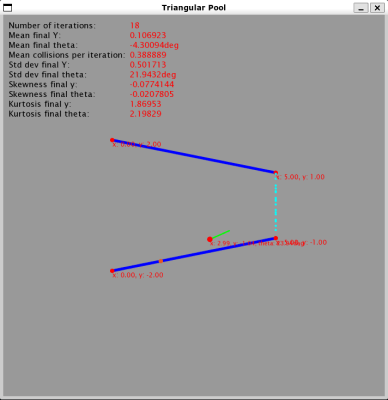

# Biliardo triangolare

Autore: *Jonathan Cancelli*

GitHub: *https://github.com/jcancelli/triangular-pool*

- [Introduzione](#introduzione)
	- [Abstract](#abstract)
	- [Input](#input)
	- [Output](#output)
- [Compilazione](#compilazione)
	- [Dipendenze](#dipendenze)
	- [Comandi](#comandi)
	- [Warnings aspettati](#warnings-aspettati)
- [Esecuzione](#esecuzione)
	- [Argomenti CLI](#argomenti-cli)
	- [Modalità d'esecuzione](#modalità-desecuzione)

## Introduzione

### Abstract

Il programma si pone lo scopo di simulare il comportamento di una
particella in movimento all'interno di un "biliardo triangolare", ovvero
un sistema delimitato da una barriera superiore e da una inferiore (vedi figura).


In questa simulazione la particella partirà dalla posizione $(0, y_i)$ con
una direzione definita dall'angolo $\theta_i$ e, a seguito di $n$ collisioni elastiche con
le barriere, raggiungerà la posizione $(l, y_f)$ (o in determinate condizioni $(0, y_f)$ )
con direzione $\theta_f$.

Di questa particella verranno tracciati:
- $y_i$ - Posizione sull'asse delle $y$ iniziale della particella.
- $\theta_i$ - Angolo che definisce la direzione iniziale della particella.
- $y_f$ - Posizione sull'asse delle $y$ finale della particella.
- $\theta_f$ - Angolo che definisce la direzione finale della particella.
- $c$ - Numero di collisioni per ogni iterazione.


### Input

L'utente sarà in grado di controllare i seguenti parametri:
- $r1$ - Valore della $y$ dell'estremo sinistro della barriera superiore ($-r1$ per la
barriera inferiore)
- $r2$ - Valore della $y$ dell'estremo destro della barriera superiore ($-r2$ per la
barriera inferiore)
- $l$ - Valore della $x$ dell'estremo destro di entrambe le barriere.
- $n$ - Il numero di simulazioni
- $\mu_{y_i}$ - La media della distribuzione Gaussiana di $y_i$
- $\sigma_{y_i}$ - La deviazione standard della distribuzione Gaussiana di $y_i$
- $\mu_{\theta_i}$ - La media della distribuzione Gaussiana di $\theta_i$
- $\sigma_{\theta_i}$ - La deviazione standard della distribuzione Gaussiana di $\theta_i$


### Output

Una volta terminato il programma verranno forniti in output:
- La media della distribuzione di $y_f$.
- La deviazione standard della distribuzione di $y_f$.
- La coefficiente di simmetria della distribuzione di $y_f$.
- La coefficiente di appiattimento della distribuzione di $y_f$.
- La media della distribuzione di $\theta_f$.
- La deviazione standard della distribuzione di $\theta_f$.
- La coefficiente di simmetria della distribuzione di $\theta_f$.
- La coefficiente di appiattimento della distribuzione di $\theta_f$.
- La media del numero di collisioni per ogni iterazione.


Ulteriori informazioni su input e output nella sezione [Argomenti CLI](#argomenti-cli).

[Torna all'indice](#biliardo-triangolare)


## Compilazione

### Dipendenze
- CMake
- SFML

### Comandi

*Assicurasi di trovarsi nella root del progetto.*

| Azione |  Comando |
|--------|----------|
| Setup build system | `cmake -S . -B build` |
| Build progetto | `cmake --build build` |


### Warnings aspettati

Ecco una lista di warnings dovuti a librerie esterne.

| Warning | File |
|---------|------|
|`unused-parameter`| `src/libraries/argumentum/include/../include/argumentum/../../src/optionpack.h:19:50` |
| `unused-parameter` | `src/libraries/argumentum/include/../include/argumentum/../../src/argumentstream_impl.h:11:93` |
| `unused-parameter` | `src/libraries/argumentum/include/../include/argumentum/../../src/parserconfig_impl.h:94:26` |

Esclusi i warning appena elencati, la compilazione dovrebbe risultare
priva di warnings.

[Torna all'indice](#biliardo-triangolare)


## Esecuzione

*Assicurasi di trovarsi nella root del progetto.*

Il programma viene compilato nell'eseguibile `./build/src/triangular_pool`


### Argomenti CLI

E' possibile modificare il comportamento di Trangular Pool attraverso
l'uso di alcuni parametri e flags che possono essere passati all'eseguibile.
In ogni momento è possibile accedere ad una lista di questi parametri eseguendo
triangular pool con l'opzione `--help` o `-h`.

```
$ ./build/src/triangular_pool --help
usage: ./build/src/triangular_pool [--r1 R1] [--r2 R2] [--l L] [--n N] [--mean-y
MEAN-Y] [--std-dev-y STD-DEV-Y] [--mean-theta MEAN-THETA] [--std-dev-theta
STD-DEV-THETA] [--speed SPEED] [--verbose] [--graphics] [--help]

Simulation of a triangular pool

optional arguments:
  --r1 R1                     Value of y of the leftmost extreme of the upper
                              wall (-r1 for the lower wall).
  --r2 R2                     Value of y of the rightmost extreme of the upper
                              wall (-r2 for the lower wall).
  --l L                       Value of x of the rightmost extreme of both walls.
  --n N                       Number of iterations of the simulation.
  --mean-y MEAN-Y             Mean value of the initial y coordinate of the
                              particle (normal distribution).
  --std-dev-y STD-DEV-Y       Standard deviation of the initial particle y
                              coordinate.
  --mean-theta MEAN-THETA     Mean value of the initial angle of direction of
                              the particle in degrees (normal distribution).
  --std-dev-theta STD-DEV-THETA
                              Standard deviation of the initial particle
                              direction angle value.
  --speed SPEED               Speed of the simulation. If the flag --graphics is
                              not present this value will be ignored.
  --verbose                   Value of y of the leftmost extreme of the upper
                              wall (-r1 for the lower wall).
  --graphics                  Enables graphical visualization of the simulation.
                              In graphical mode the simulation keeps iterating
                              until the program is stopped (the parameter n is
                              ignored).
  -h, --help                  Display this help message and exit.
```

### Modalità d'esecuzione


#### Testuale

Modalità di default (se non viene passata la flag `--graphics`). Output solamente nel terminale.

```
$ ./build/src/triangular_pool --verbose --n=100

------ Stats ------
N:                      100                     Number of iterations
mean Y:                 0.103339                Mean final Y
mean theta:             -3.10108°               Mean final particle direction angle
mean collisions:        0.4             Mean number of collisions per iteration
stddev y:               0.643225                Standard deviation final Y
stddev theta:           23.0848°                Standard deviation final particle direction angle
sym Y:                  -0.427097               Symmetry coefficient final Y
sym theta:              -0.292333               Symmetry coefficient final particle direction angle
flat Y:                 3.51424         Flattening coefficient final Y
flat theta:             3.31438         Flattening coefficient final particle direction angle
------ Details ------
Iteration #1
        Initial position:       { x: 0, y: 1.60159 }
        Initial theta:          1.74768°
        Final position:         { x: 5, y: 0.17248 }
        Final theta:            -24.3675°
        Collisions:
                { x: 1.72836, y: 1.65433 }
```


#### Grafica

Modalità attivata dalla flag `--graphics`. In essa l'utente può osservare l'evoluzione
della simulazione in real time. E' possibile controllare la velocità della simulazione
grafica passando la flag `--speed=<number>`.



[Torna all'indice](#biliardo-triangolare)