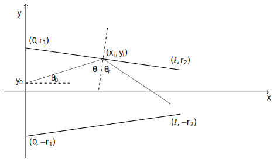

# Biliardo triangolare

Autore: *Jonathan Cancelli*

GitHub: *https://github.com/jcancelli/triangular-pool*

- [Introduzione](#introduzione)
	- [Abstract](#abstract)
	- [Input](#input)
	- [Output](#output)
- [Compilazione](#compilazione)
	- [Dipendenze](#dipendenze)
	- [Comandi](#comandi)
- [Esecuzione](#esecuzione)
	- [CLI Arguments](#cli-arguments)

## Introduzione

### Abstract

Il programma si pone lo scopo di simulare il comportamento di una
particella in movimento all'interno di un "biliardo triangolare", ovvero
un sistema delimitato da una barriera superiore e da una inferiore (vedi figura).

In questa simulazione la particella partirà dalla posizione $(0, y_i)$ con
una direzione definita dall'angolo $\theta_i$ e, a seguito di $n$ collisioni elastiche con
le barriere, raggiungerà la posizione $(l, y_f)$ (o in determinate condizioni $(0, y_f)$ )
con direzione $\theta_f$.

Di questa particella verranno tracciati:
- $y_i$ - Posizione sull'asse delle $y$ iniziale della particella.
- $\theta_i$ - Angolo che definisce la direzione iniziale della particella.
- $y_f$ - Posizione sull'asse delle $y$ finale della particella.
- $\theta_f$ - Angolo che definisce la direzione finale della particella.
- $c$ - Numero di collisioni per ogni iterazione.

### Input

L'utente sarà in grado di controllare i seguenti parametri:
- $r1$ - Valore della $y$ dell'estremo sinistro della barriera superiore ($-r1$ per la
barriera inferiore)
- $r2$ - Valore della $y$ dell'estremo destro della barriera superiore ($-r2$ per la
barriera inferiore)
- $l$ - Valore della $x$ dell'estremo destro di entrambe le barriere.
- $n$ - Il numero di simulazioni
- $\mu_{y_i}$ - La media della distribuzione Gaussiana di $y_i$
- $\sigma_{y_i}$ - La deviazione standard della distribuzione Gaussiana di $y_i$
- $\mu_{\theta_i}$ - La media della distribuzione Gaussiana di $\theta_i$
- $\sigma_{\theta_i}$ - La deviazione standard della distribuzione Gaussiana di $\theta_i$

### Output

Una volta terminato il programma verranno forniti in output:
- La media della distribuzione di $y_f$.
- La deviazione standard della distribuzione di $y_f$.
- La coefficiente di simmetria della distribuzione di $y_f$.
- La coefficiente di appiattimento della distribuzione di $y_f$.
- La media della distribuzione di $\theta_f$.
- La deviazione standard della distribuzione di $\theta_f$.
- La coefficiente di simmetria della distribuzione di $\theta_f$.
- La coefficiente di appiattimento della distribuzione di $\theta_f$.
- La media del numero di collisioni per ogni iterazione.

Informazioni ulteriori su input e output nella sezione [CLI Arguments](#cli-arguments).

## Compilazione

### Dipendenze
- CMake
- SFML

### Comandi

*Assicurasi di trovarsi nella root del progetto.*

| Azione |  Comando |
| -------|----------|
| Setup build system | `cmake -S . -B build` |
| Build progetto | `cmake --build build` |

## Esecuzione

*Assicurasi di trovarsi nella root del progetto.*

Il programma viene compilato nell'eseguibile `./build/src/triangular_pool`

### CLI arguments

E' possibile modificare il comportamento di Trangular Pool attraverso
l'uso di alcuni parametri e flags che possono essere passati all'eseguibile.
In ogni momento è possibile accedere ad una lista di questi parametri eseguendo
triangular pool con l'opzione `--help` o `-h`.